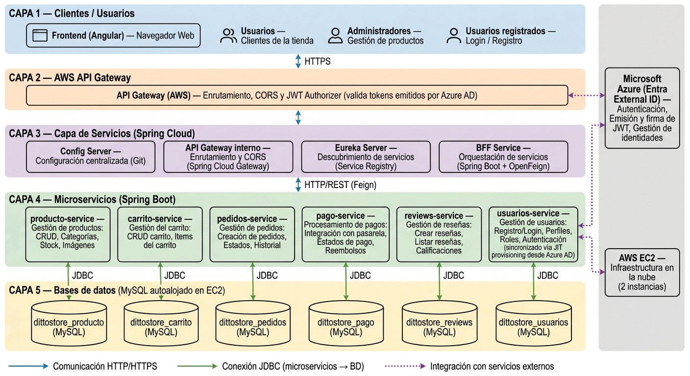

<p align="center">
  
</p>
<h1 align="center">Ditto Store</h1>
 
E-commerce de cartas Pokémon TCG construido con arquitectura de microservicios, autenticación real vía Microsoft Entra External ID, y despliegue en AWS.
 
---

## Descripción del proyecto

Ditto Store es una tienda en línea de cartas y cajas de Pokémon TCG. El sistema no cuenta con registro propio de usuarios: la autenticación se delega completamente a un tenant de **Microsoft Entra External ID**, y el rol de cada usuario (Cliente o Administrador) se gestiona en el backend propio.

La aplicación está compuesta por:

- Un **backend de microservicios** en Spring Boot, con descubrimiento de servicios, configuración centralizada y un Backend For Frontend (BFF) que valida los tokens JWT.
- Un **frontend en Angular** con dos experiencias diferenciadas por rol: la tienda para clientes y un panel de administración.
- Una capa de **API Manager en AWS** (HTTP API Gateway) que actúa como puerta de entrada pública al backend, con su propio Authorizer JWT.

---

## Arquitectura


La autenticación corre en paralelo: el frontend usa **MSAL** para autenticar contra Azure AD, obtiene un token JWT, y ese mismo token viaja en cada request hasta el BFF (o directo a `producto-service`/`reviews-service` en las rutas que van sin pasar por el BFF), que lo valida (firma, issuer, audience y vigencia) antes de dejar pasar la petición.

> Hay **dos capas de CORS** independientes en el camino: la del AWS API Gateway (a nivel de API, configurable en la consola) y la del API Gateway interno de Spring (`CorsConfig.java`). Si se agrega un nuevo dominio de frontend, hay que agregarlo **en ambas**, o el backend interno rechazará la petición con `403` aunque AWS ya la haya dejado pasar (ver [Problemas conocidos](#-problemas-conocidos-y-sus-soluciones)).

---

## Stack tecnológico

| Capa | Tecnología |
|---|---|
| Backend | Java 17, Spring Boot 4.0.8, Spring Cloud (Eureka, Config Server, Gateway, OpenFeign) |
| Base de datos | MySQL 8 |
| Frontend | Angular (standalone components), MSAL v4 |
| Autenticación | Microsoft Entra External ID (Azure AD, tipo CIAM) |
| Nube | AWS (EC2, API Gateway) — cuenta de laboratorio estudiantil |
| Hosting frontend | Netlify (build vía variable de entorno, ver más abajo) |
| Build | Maven (backend), Angular CLI (frontend) |

---

## Estructura del repositorio

```
DittoStore/
├── backend/
│   ├── pom.xml                      # POM padre (dependencias compartidas)
│   ├── infrastructure/
│   │   ├── pom.xml
│   │   ├── eureka-server/
│   │   ├── config-server/
│   │   ├── api-gateway/             # Gateway interno Spring Cloud (CORS + rutas)
│   │   └── bff-service/
│   ├── businessdomain/
│   │   ├── pom.xml
│   │   ├── producto-service/
│   │   ├── usuarios-service/
│   │   ├── carrito-service/
│   │   ├── pedidos-service/
│   │   ├── pago-service/
│   │   └── reviews-service/
│   └── config-repo/                 # Configuración centralizada (Config Server)
└── frontend/
    ├── set-env.js                   # Genera environment.prod.ts en cada build (ver más abajo)
    ├── src/app/
    │   ├── core/                    # Servicios, guards, modelos compartidos
    │   ├── features/
    │   │   └── admin/               # Panel de administración
    │   ├── shared/                  # Navbar, footer, componentes reutilizables
    │   ├── pages/                   # Páginas públicas de la tienda
    │   └── msal.config.ts           # protectedResourceMap: qué rutas llevan el Bearer token
    └── src/environments/
```

---

## Requisitos previos

- Java 17
- Maven (o usar el wrapper `./mvnw` incluido)
- Node.js 18+ y npm
- MySQL (local, ej. vía Laragon/XAMPP, o accesible remotamente)
- Angular CLI (`npm install -g @angular/cli`)
- Una cuenta de Azure con un tenant de Microsoft Entra External ID configurado (ver sección de Autenticación)

---

## Levantar el backend en local

1. **Configura MySQL**: crea las 6 bases de datos vacías (se autogeneran las tablas vía JPA):
   ```sql
   CREATE DATABASE dittostore_producto;
   CREATE DATABASE dittostore_usuarios;
   CREATE DATABASE dittostore_carrito;
   CREATE DATABASE dittostore_pedidos;
   CREATE DATABASE dittostore_pago;
   CREATE DATABASE dittostore_reviews;
   ```
   Por defecto, cada microservicio se conecta con el usuario `root` sin contraseña (ajusta en cada `application.properties` si el entorno usa otras credenciales).

2. **Compila el backend completo**:
   ```bash
   cd backend
   ./mvnw clean package -DskipTests
   ```

3. **Levanta los servicios en este orden** (cada uno en su propia terminal, o usando Spring Boot Dashboard):
   ```bash
   # 1. Eureka Server (registro de servicios)
   java -jar infrastructure/eureka-server/target/eureka-server-0.0.1-SNAPSHOT.jar

   # 2. Config Server (configuración centralizada, vía config-repo/ en este mismo repo)
   java -jar infrastructure/config-server/target/config-server-0.0.1-SNAPSHOT.jar

   # 3. API Gateway y BFF
   java -jar infrastructure/api-gateway/target/api-gateway-0.0.1-SNAPSHOT.jar
   java -jar infrastructure/bff-service/target/bff-service-0.0.1-SNAPSHOT.jar

   # 4. Los 6 microservicios de negocio (orden indistinto entre ellos)
   java -jar businessdomain/producto-service/target/producto-service-0.0.1-SNAPSHOT.jar
   java -jar businessdomain/usuarios-service/target/usuarios-service-0.0.1-SNAPSHOT.jar
   java -jar businessdomain/carrito-service/target/carrito-service-0.0.1-SNAPSHOT.jar
   java -jar businessdomain/pedidos-service/target/pedidos-service-0.0.1-SNAPSHOT.jar
   java -jar businessdomain/pago-service/target/pago-service-0.0.1-SNAPSHOT.jar
   java -jar businessdomain/reviews-service/target/reviews-service-0.0.1-SNAPSHOT.jar
   ```

4. **Verifica**: entra a `http://localhost:8761` — deberías ver los 10 servicios registrados como `UP`.
---
### Puertos de referencia
---
| Servicio | Puerto |
|---|---|
| Eureka Server | 8761 |
| Config Server | 8888 |
| API Gateway (interno) | 8080 |
| BFF Service | 8081 |
| producto-service | 8082 |
| usuarios-service | 8083 |
| carrito-service | 8084 |
| pedidos-service | 8085 |
| pago-service | 8086 |
| reviews-service | 8087 |

---

## Levantar el frontend en local

```bash
cd frontend
npm install --legacy-peer-deps
ng serve
```

Abrir `http://localhost:4200`. Por defecto, el `environment.ts` (development) apunta al backend local (`http://localhost:8081` / `http://localhost:8080`) — este archivo no se toca nunca, a diferencia de `environment.prod.ts` (ver sección siguiente).

> **Nota**: el proyecto usa detección de cambios *zoneless*. Si se construye un componente nuevo que actualiza datos dentro de un `.subscribe()` (HTTP, MSAL, etc.), la vista no se refresca sola — inyecta `ChangeDetectorRef` y llama a `detectChanges()` manualmente, o usa Angular Signals.

---

## Despliegue en AWS

### Instancias EC2

El backend está desplegado en **2 instancias EC2** (se dividió en dos por las limitaciones de memoria de una cuenta de AWS Academy — una sola instancia `t3.small` de 2 GB de RAM no soporta los 10 servicios de Java simultáneamente):

| Instancia | Contenido | IP elástica |
|---|---|---|
| `DittoStore` | MySQL, Eureka, Config Server, API Gateway, BFF, usuarios-service | *(ver configuración privada del equipo)* |
| `DittoStore-Negocio` | producto, carrito, pedidos, pago, reviews-service | *(ver configuración privada del equipo)* |

Los 5 microservicios de la segunda instancia usan un perfil de Spring separado (`application-prod.properties`) que apunta a la IP **privada** de la primera instancia — el `application.properties` base sigue intacto en `localhost` para que el desarrollo local no se vea afectado.

---
### Levantar las instancias (consola AWS)
---
1. Entrar a la consola de AWS (o al portal del lab estudiantil, ej. AWS Academy Learner Lab) y arranca la sesión/lab.
2. Ir a **EC2 → Instancias**, seleccionar `DittoStore` y `DittoStore-Negocio`, y presionar **Iniciar instancia** en ambas (si el lab no las levantó solo).
3. Esperar a que el estado quede en `Running` y anotar las IPs (pública/privada) — en un lab que se destruye y recrea, estas pueden cambiar.
---
### Levantar los servicios (dentro de cada instancia, por SSH)
---
Conéctate por SSH (o usa el acceso que te dé el lab) y ejecuta, en orden, en `DittoStore (ssh -i db_dittostore.pem ubuntu@35.171.64.101)`:

```bash
# MySQL normalmente arranca solo como servicio; si no, en Ubuntu:
sudo systemctl start mysql

# Servicios de infraestructura, cada uno en su propia sesión 
nohup java -Xms64m -Xmx192m -jar infrastructure/eureka-server/target/eureka-server-0.0.1-SNAPSHOT.jar > eureka.log 2>&1 &

nohup java -Xms64m -Xmx192m -jar infrastructure/config-server/target/config-server-0.0.1-SNAPSHOT.jar > config-server.log 2>&1 &

nohup java -Xms64m -Xmx192m -jar infrastructure/api-gateway/target/api-gateway-0.0.1-SNAPSHOT.jar > api-gateway.log 2>&1 &

nohup java -Xms64m -Xmx192m -jar infrastructure/bff-service/target/bff-service-0.0.1-SNAPSHOT.jar > bff-service.log 2>&1 &

nohup java -Xms64m -Xmx192m -jar businessdomain/usuarios-service/target/usuarios-service-0.0.1-SNAPSHOT.jar > usuarios-service.log 2>&1 &
```

Y en `DittoStore-Negocio (ssh -i db_dittostore.pem ubuntu@54.166.52.100)`:

```bash
nohup java -Xms64m -Xmx192m -jar businessdomain/producto-service/target/producto-service-0.0.1-SNAPSHOT.jar --spring.profiles.active=prod > producto.log 2>&1 &

nohup java -Xms64m -Xmx192m -jar businessdomain/carrito-service/target/carrito-service-0.0.1-SNAPSHOT.jar --spring.profiles.active=prod > carrito.log 2>&1 &

nohup java -Xms64m -Xmx192m -jar businessdomain/pedidos-service/target/pedidos-service-0.0.1-SNAPSHOT.jar --spring.profiles.active=prod > pedidos.log 2>&1 &

nohup java -Xms64m -Xmx192m -jar businessdomain/pago-service/target/pago-service-0.0.1-SNAPSHOT.jar --spring.profiles.active=prod > pago.log 2>&1 &

nohup java -Xms64m -Xmx192m -jar businessdomain/reviews-service/target/reviews-service-0.0.1-SNAPSHOT.jar --spring.profiles.active=prod > reviews.log 2>&1 &
```

Conectárse a MySQL directamente en la instancia con:
```bash
mysql -u root
```
---
### API Manager de AWS (HTTP API Gateway)

Rutas configuradas en el API Gateway (visibles en **API Gateway → tu API → Routes**):

| Ruta | Métodos | Autorización |
|---|---|---|
| `/api/productos` | `GET`, `POST` | Sin autorizador (pública) |
| `/api/productos/{id}` | `GET`, `PUT`, `DELETE` | Sin autorizador (pública) |
| `/{proxy+}` | `ANY` | JWT Authorizer (tenant de Azure) |
| `/{proxy+}` | `OPTIONS` | **Sin autorizador** — necesaria para que el preflight de CORS no choque con el JWT Authorizer de la ruta `ANY` |

El endpoint `GET` de productos quedan públicos porque no debería requerirse login solo para navegar el catálogo; todo lo demás (`/bff/*`, `/api/carritos/*`, `/api/pedidos/*`, `/api/pagos/*`, `/api/reviews/*`, `/api/usuarios/*`) cae en el catch-all `ANY /{proxy+}` y exige un JWT válido.

**CORS a nivel de API** (API Gateway → tu API → CORS):

- **Access-Control-Allow-Origin**: `http://localhost:4200`, `https://dittostore.netlify.app`
- **Access-Control-Allow-Headers**: `content-type`, `authorization`
- **Access-Control-Allow-Methods**: `GET`, `POST`, `PATCH`, `PUT`, `DELETE`, `OPTIONS`
- **Access-Control-Allow-Credentials**: No

> Esta configuración de CORS y las rutas anteriores viven **únicamente en el recurso de AWS**, no en el código — si el API Gateway se recrea (ver más abajo), hay que rehacerlas a mano.

### Cuando el API Gateway cambia de ID

Si AWS genera el ID del API Gateway automáticamente y no se puede fijar, cada vez que el lab se recrea hay que hacer:

1. **Recrear las rutas y el CORS** de la tabla de arriba en el API Gateway nuevo (y volver a asociar el JWT Authorizer a `ANY /{proxy+}`).
2. **Copiar el nuevo Invoke URL** del API Gateway (algo como `https://<nuevo-id>.execute-api.us-east-1.amazonaws.com/dev`).
3. **Actualizar la variable de entorno `API_GATEWAY_URI` en Netlify** (Site configuration → Environment variables) con ese nuevo valor — **no** se edita `environment.prod.ts` a mano.
4. **Disparar un nuevo deploy en Netlify** (push, o *Trigger deploy* manual). El build corre `npm run build:prod`, que ejecuta `frontend/set-env.js` y regenera `environment.prod.ts` con la URL nueva antes de compilar.

Este flujo (variable de entorno + `set-env.js`) existe justamente para no tener que editar código ni hacer commits cada vez que el lab se reinicia — solo se toca el valor en el panel de Netlify.

---

## Autenticación con Azure AD

El sistema usa **Microsoft Entra External ID** (un tenant tipo CIAM, pensado para aplicaciones de cara a clientes). Se registraron dos aplicaciones dentro del mismo tenant:

- **`DittoStore-Backend-API`**: expone el scope `Store.Access` que el frontend solicita al hacer login. Requiere `requestedAccessTokenVersion: 2` en su manifiesto (sin esto, el token emitido usa un formato de audience distinto al que espera Spring Security).
- **`DittoStore-Frontend`**: aplicación tipo SPA, con los redirect URIs de cada entorno donde corra el frontend (local y el hosting final).

Como no hay registro propio de usuarios, **los usuarios se crean directamente en el tenant de Azure** (Microsoft Entra ID → Usuarios → Nuevo usuario). El rol de negocio (`CLIENTE`/`ADMIN`) se gestiona por separado en `usuarios-service`, y se asigna manualmente vía la API (`PUT /api/usuarios/{id}`) o directo en MySQL (ver [Conectar el usuario a rol Admin](#conectar-el-usuario-a-rol-admin-para-pruebas)) — Azure no tiene ningún concepto de "rol de tienda".

Al iniciar sesión por primera vez, el BFF sincroniza automáticamente el perfil del usuario en `usuarios-service` (JIT provisioning), usando los datos disponibles en el token.

> Importante: el **Issuer** real de este tipo de tenant usa el Tenant ID como subdominio (`https://<tenant-id>.ciamlogin.com/<tenant-id>/v2.0`) — no el dominio `.onmicrosoft.com` ni el dominio "vanity" del tenant.

### `protectedResourceMap` (MSAL, frontend)

`frontend/src/app/msal.config.ts` define a qué peticiones el interceptor de MSAL le agrega el header `Authorization: Bearer <token>`, usando patrones con wildcard (`*`). Ojo con la diferencia entre:

- `/algo/*` → exige algo **después** de la barra final; no matchea una llamada a la ruta base `/algo` sin subpath.
- `/algo*` → matchea tanto `/algo` como `/algo/lo-que-sea`.

Si agregas un endpoint nuevo que se llama a veces en su ruta base (ej. un `POST` de creación) y a veces con subpath (ej. `GET /algo/{id}`), usa el segundo patrón (`/algo*`) para cubrir ambos casos.

---

## Pruebas

- Cada microservicio incluye tests unitarios con **Mockito** sobre su capa de servicio.
- Las pruebas de integración de los endpoints se hicieron manualmente con **Postman**, incluyendo:
  - CRUD completo de cada microservicio.
  - Validación de JWT en el BFF (firma, issuer, audience, vigencia).
  - Caso de **token vencido**, confirmando que el sistema rechaza correctamente el acceso una vez expirado.

---

## Decisiones de diseño relevantes

- **MySQL con usuario `root`** en los 6 microservicios, en vez de un usuario dedicado por servicio — decisión de equipo para simplificar, ya que la pauta no exige aislamiento de credenciales por base de datos.
- **`usuarios-service` no valida JWT por sí mismo** — solo el BFF lo hace. Los microservicios internos confían en que únicamente el BFF puede alcanzarlos (patrón de "zona de confianza interna").
- **Los endpoints `GET` de productos son públicos** — no se exige autenticación para navegar el catálogo, solo para acciones que impliquen al usuario (carrito, pago, reviews).
- **2 instancias EC2** en vez de una sola, por restricciones de memoria de la cuenta de AWS Academy.
- **La URL del API Gateway se inyecta en build-time vía Netlify (`API_GATEWAY_URI` → `set-env.js` → `environment.prod.ts`)**, en vez de quedar hardcodeada en el código, para no depender de un commit cada vez que el lab estudiantil se reinicia y el API Gateway cambia de ID.

---

## Problemas conocidos y sus soluciones

| Problema | Causa | Solución |
|---|---|---|
| MySQL rechaza conexiones remotas entre instancias EC2 | Ubuntu configura `bind-address=127.0.0.1` por defecto | Cambiar a `0.0.0.0` en `mysqld.cnf` y otorgar el usuario con `@'%'` |
| Feign lanza `Invalid HTTP method: PATCH` | El cliente HTTP por defecto de Feign (`HttpURLConnection`) no soporta PATCH | Agregar la dependencia `feign-okhttp` y declarar un bean de tipo `feign.Client` respaldado por `feign.okhttp.OkHttpClient` |
| Componentes de Angular no reflejan datos tras un `.subscribe()` | El proyecto usa detección de cambios zoneless | Inyectar `ChangeDetectorRef` y llamar `detectChanges()`, o usar Signals |
| Frontend en Netlify: `net::ERR_NAME_NOT_RESOLVED` hacia el API Gateway | El lab estudiantil se cerró/reinició, el API Gateway se recreó con un ID nuevo y el frontend seguía apuntando al ID viejo | Actualizar la variable `API_GATEWAY_URI` en Netlify con el nuevo Invoke URL y redeployar (ver [Cuando el lab se reinicia](#cuando-el-lab-se-reinicia-y-el-api-gateway-cambia-de-id)) |
| `403 Forbidden` en rutas públicas (ej. `GET /api/productos`) aunque no tengan Authorizer en AWS | El `CorsFilter` del API Gateway **interno** de Spring (`CorsConfig.java`) rechaza con 403 cualquier request cuyo `Origin` no esté en su lista de orígenes permitidos — es una capa de CORS aparte de la de AWS | Agregar el dominio de producción (`https://dittostore.netlify.app`) a `allowedOrigins` en `CorsConfig.java`, recompilar y redesplegar el jar de `api-gateway` |
| Preflight de CORS falla en rutas protegidas (ej. `/bff/perfil`), mensaje "doesn't pass access control check: It does not have HTTP ok status" | El preflight `OPTIONS` no lleva header `Authorization`; si cae en la misma ruta que exige el JWT Authorizer (`ANY /{proxy+}`), el Authorizer lo rechaza con status no-2xx | Crear una ruta explícita `OPTIONS /{proxy+}` **sin** autorizador en el API Gateway de AWS |
| `POST` a una ruta protegida no lleva el token (`401 Unauthorized`), aunque otras peticiones a rutas "hermanas" sí funcionan | El patrón en `protectedResourceMap` (ej. `/api/reviews/*`) exige un segmento después de la barra final; una llamada a la ruta base sin subpath (ej. `POST /api/reviews`) no matchea, así que MSAL no le agrega el Bearer token | Cambiar el patrón a `/api/reviews*` (sin la barra antes del asterisco) para que cubra tanto la ruta base como las rutas con subpath |

---
